# langx.io rankings, 2026-09-19 to 2026-09-25

Google Search Console, web search, property `sc-domain:langx.io`. Compared with 2026-09-12 to 2026-09-18. Position is the average rank when the page was shown; ↑ means it moved up. Queries with fewer than 20 impressions in either week are left out of the movers, since one search can swing them by whole places. Google hides rare queries, so a tracked keyword can be missing even when the page ranks for it.

## Totals

|  | This week | Week before |
| --- | --- | --- |
| Clicks | 97 | 135 |
| Impressions | 7,711 | 13,529 |
| CTR | 1.3% | 1.0% |
| Average position | 7.1 | 7.7 |

## Trends

The last 12 weeks, 2026-07-04 to 2026-09-25. Each point is the seven days ending on the date shown; the last one is this report’s week.

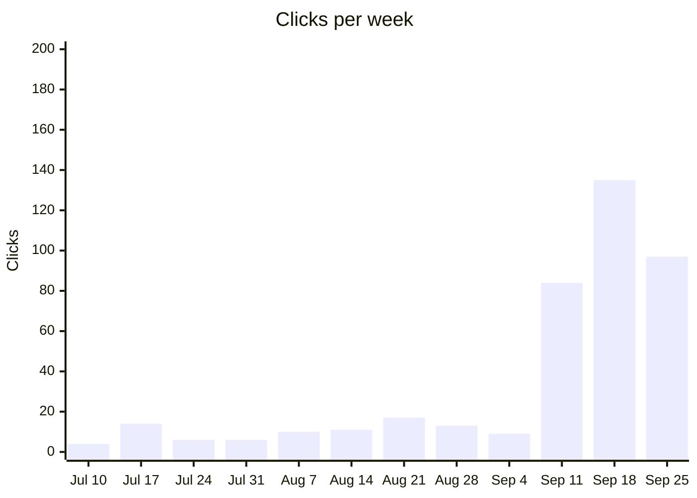

Jul 10: 4 · Jul 17: 14 · Jul 24: 6 · Jul 31: 6 · Aug 7: 10 · Aug 14: 11 · Aug 21: 17 · Aug 28: 13 · Sep 4: 9 · Sep 11: 84 · Sep 18: 135 · Sep 25: 97

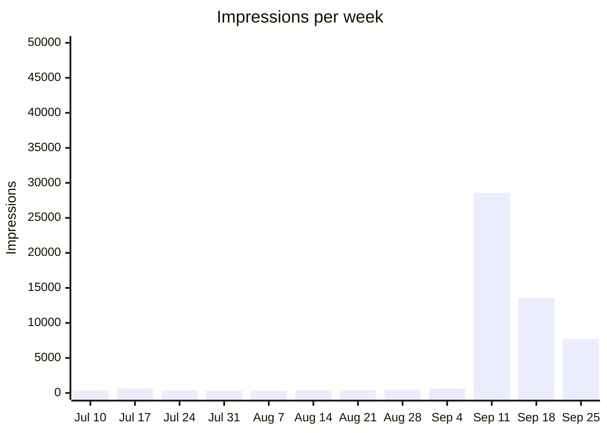

Jul 10: 356 · Jul 17: 612 · Jul 24: 357 · Jul 31: 349 · Aug 7: 279 · Aug 14: 368 · Aug 21: 392 · Aug 28: 474 · Sep 4: 601 · Sep 11: 28,541 · Sep 18: 13,529 · Sep 25: 7,711

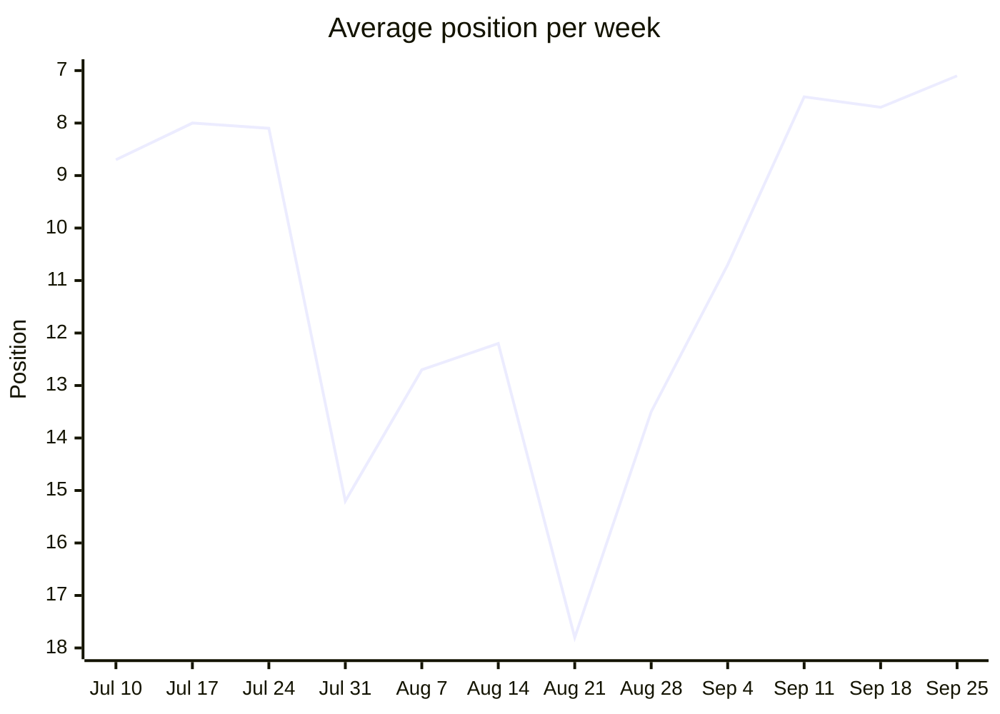

Jul 10: 8.7 · Jul 17: 8.0 · Jul 24: 8.1 · Jul 31: 15.2 · Aug 7: 12.7 · Aug 14: 12.2 · Aug 21: 17.8 · Aug 28: 13.5 · Sep 4: 10.7 · Sep 11: 7.5 · Sep 18: 7.7 · Sep 25: 7.1

Lower is better. The axis runs from the worst position at the bottom to the best at the top, so a rising line is a gain.

### Queries by position

How many queries averaged each rank that week. Search Console leaves rare queries out of query rows, so these add up to less than every search.

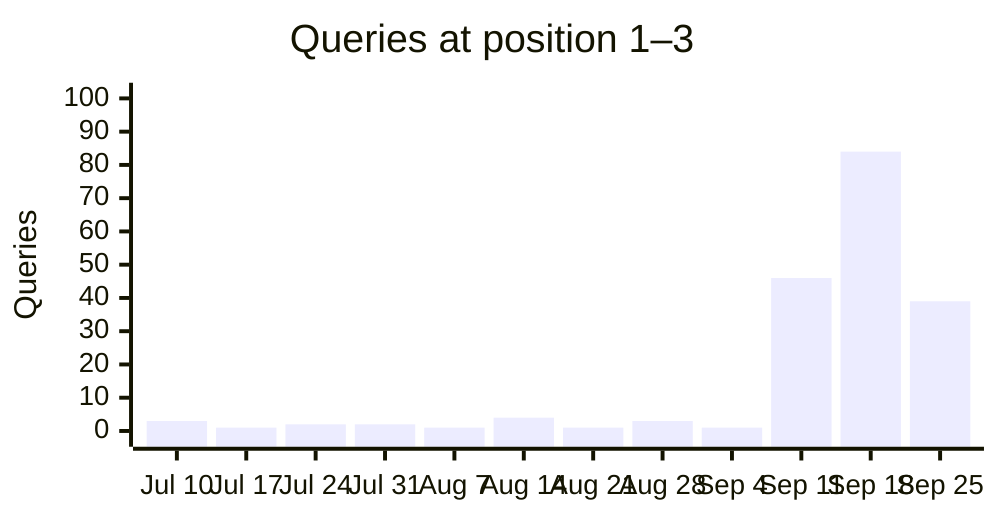

Jul 10: 3 · Jul 17: 1 · Jul 24: 2 · Jul 31: 2 · Aug 7: 1 · Aug 14: 4 · Aug 21: 1 · Aug 28: 3 · Sep 4: 1 · Sep 11: 46 · Sep 18: 84 · Sep 25: 39

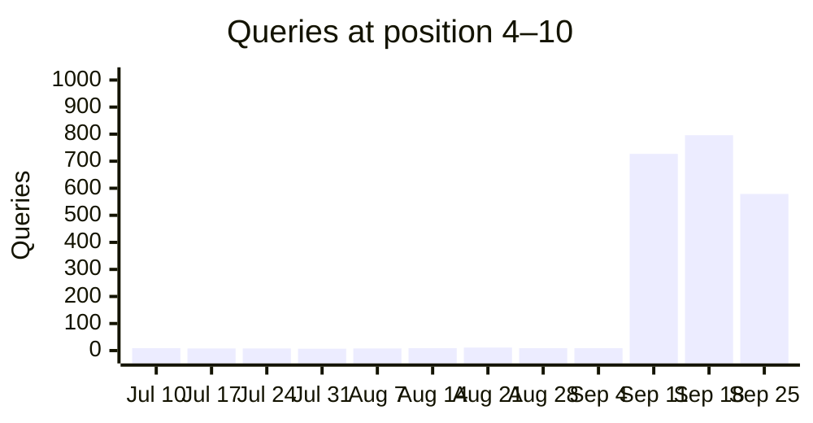

Jul 10: 9 · Jul 17: 8 · Jul 24: 8 · Jul 31: 7 · Aug 7: 8 · Aug 14: 9 · Aug 21: 11 · Aug 28: 9 · Sep 4: 9 · Sep 11: 727 · Sep 18: 796 · Sep 25: 579

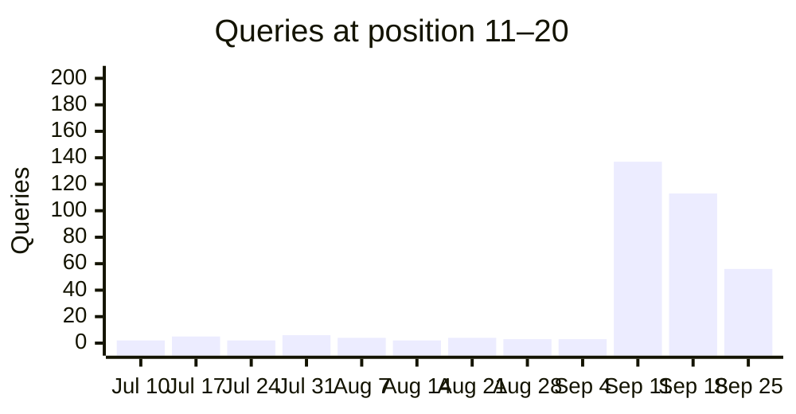

Jul 10: 2 · Jul 17: 5 · Jul 24: 2 · Jul 31: 6 · Aug 7: 4 · Aug 14: 2 · Aug 21: 4 · Aug 28: 3 · Sep 4: 3 · Sep 11: 137 · Sep 18: 113 · Sep 25: 56

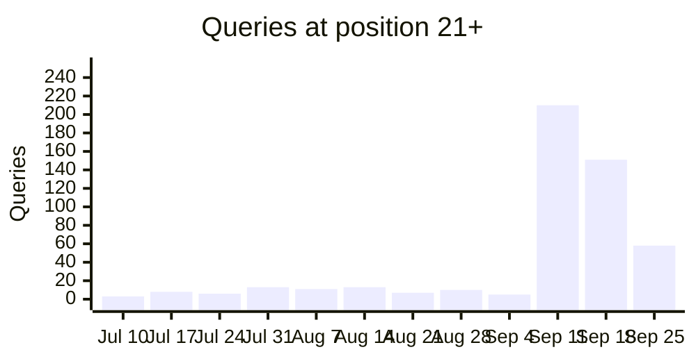

Jul 10: 3 · Jul 17: 8 · Jul 24: 6 · Jul 31: 13 · Aug 7: 11 · Aug 14: 13 · Aug 21: 7 · Aug 28: 10 · Sep 4: 5 · Sep 11: 210 · Sep 18: 151 · Sep 25: 58

### Tracked keywords over time

Average position per week for the tracked keywords seen in at least 3 weeks, the 6 with the most impressions first. Weeks the keyword was not seen are skipped, so the points are not always evenly spaced in time. 1 more have enough weeks but fewer impressions. 6 more were seen in fewer than 3 weeks.

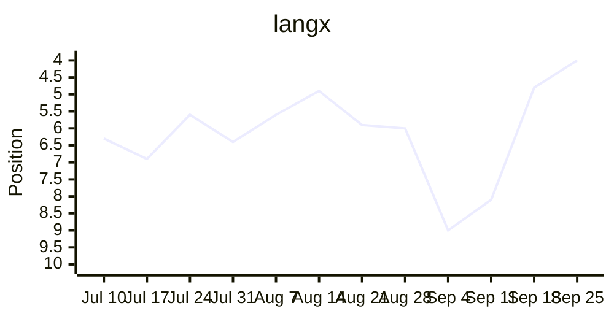

Jul 10: 6.3 · Jul 17: 6.9 · Jul 24: 5.6 · Jul 31: 6.4 · Aug 7: 5.6 · Aug 14: 4.9 · Aug 21: 5.9 · Aug 28: 6.0 · Sep 4: 9.0 · Sep 11: 8.1 · Sep 18: 4.8 · Sep 25: 4.0

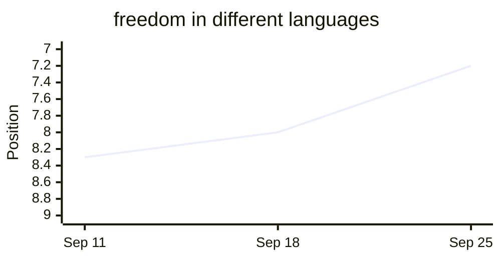

Sep 11: 8.3 · Sep 18: 8.0 · Sep 25: 7.2

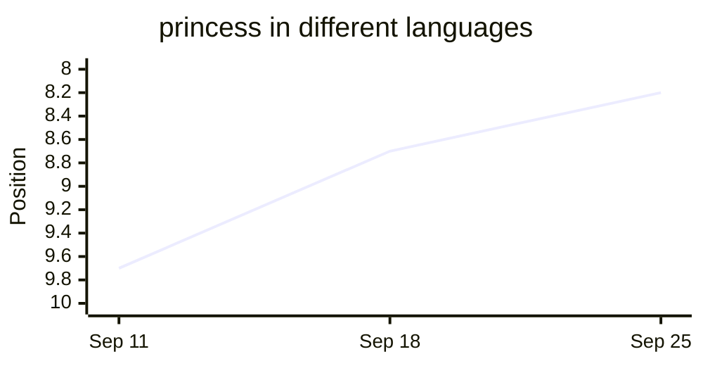

Sep 11: 9.7 · Sep 18: 8.7 · Sep 25: 8.2

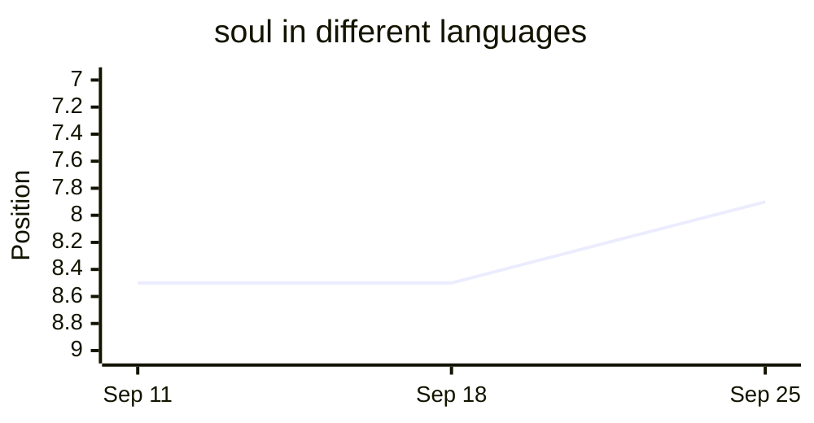

Sep 11: 8.5 · Sep 18: 8.5 · Sep 25: 7.9

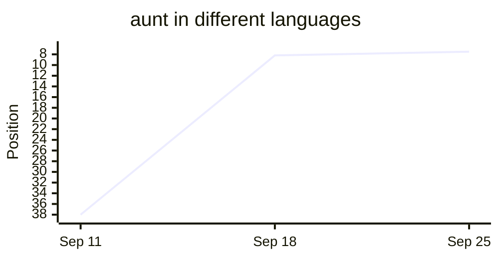

Sep 11: 38.0 · Sep 18: 8.2 · Sep 25: 7.5

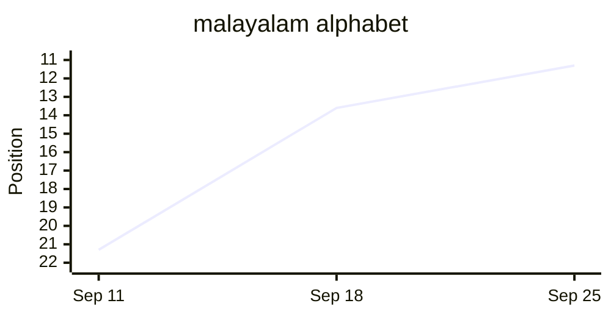

Sep 11: 21.3 · Sep 18: 13.6 · Sep 25: 11.3

## Tracked keywords

| Keyword | Position | Clicks | Impressions |
| --- | --- | --- | --- |
| langx | 4.0 (↑0.8) | 12 | 49 |
| langx app | — | 0 | 0 |
| language exchange app | — | 0 | 0 |
| free language exchange app | — | 0 | 0 |
| open source language exchange app | — | 0 | 0 |
| best language exchange apps | — | 0 | 0 |
| best language exchange app | — | 0 | 0 |
| tandem alternative | 11.0 | 0 | 1 |
| hellotalk alternative | — | 0 | 0 |
| apps like hellotalk | — | 0 | 0 |
| tandem vs hellotalk | — | 0 | 0 |
| hellotalk vs tandem | — | 0 | 0 |
| is hellotalk free | 8.8 | 0 | 8 |
| is tandem free | — | 0 | 0 |
| language exchange partner online | — | 0 | 0 |
| how to find a language exchange partner | — | 0 | 0 |
| what is a language exchange | — | 0 | 0 |
| language exchange conversation topics | — | 0 | 0 |
| duolingo alternatives for speaking | — | 0 | 0 |
| how many words do you need to be fluent | — | 0 | 0 |
| most common words in spanish | — | 0 | 0 |
| spanish vocabulary test | — | 0 | 0 |
| guess the language game | — | 0 | 0 |
| open source alternative to tandem | — | 0 | 0 |
| open source alternative to hellotalk | — | 0 | 0 |
| langx vs tandem | — | 0 | 0 |
| langx vs hellotalk | — | 0 | 0 |
| social alternative to duolingo | — | 0 | 0 |
| duolingo with real people | — | 0 | 0 |
| social language learning apps | — | 0 | 0 |
| best language learning apps | — | 0 | 0 |
| free language learning apps | — | 0 | 0 |
| free language exchange apps | — | 0 | 0 |
| can you become fluent with duolingo | — | 0 | 0 |
| best language exchange apps 2026 | — | 0 | 0 |
| best language exchange apps for beginners | — | 0 | 0 |
| language exchange apps | — | 0 | 0 |
| how long does it take to learn a language | — | 0 | 0 |
| easiest languages to learn for english speakers | — | 0 | 0 |
| shadowing technique | — | 0 | 0 |
| comprehensible input | — | 0 | 0 |
| spaced repetition language learning | — | 0 | 0 |
| best pen pal apps | — | 0 | 0 |
| language exchange discord | — | 0 | 0 |
| language exchange meetup | — | 0 | 0 |
| is hellotalk safe | — | 0 | 0 |
| is tandem safe | — | 0 | 0 |
| malayalam alphabet | 11.3 (↑2.3) | 0 | 12 |
| most common tagalog words | — | 0 | 0 |
| most common afrikaans words | — | 0 | 0 |
| princess in different languages | 8.2 (↑0.5) | 0 | 29 |
| freedom in different languages | 7.2 (↑0.7) | 0 | 69 |
| soul in different languages | 7.9 (↑0.6) | 0 | 33 |
| aunt in different languages | 7.5 (↑0.7) | 0 | 6 |

## Top queries

| Query | Position | Clicks | Impressions | CTR |
| --- | --- | --- | --- | --- |
| langx | 4.0 (↑0.8) | 12 | 49 | 24.5% |
| lang x | 3.5 (↑0.4) | 3 | 23 | 13.0% |
| everything in different languages | 5.1 (↑1.2) | 1 | 27 | 3.7% |
| boss in different languages | 6.9 (↓0.1) | 1 | 26 | 3.8% |
| beauty in different languages | 10.0 | 1 | 9 | 11.1% |
| dark in different languages | 5.8 (↑0.6) | 1 | 5 | 20.0% |
| holy in other languages | 5.4 (↓0.6) | 1 | 5 | 20.0% |
| medicine in other languages | 7.0 (↑0.6) | 1 | 5 | 20.0% |
| the end in all languages | 8.2 (↑0.8) | 1 | 5 | 20.0% |
| surprise in different languages | 5.0 (↓0.1) | 1 | 4 | 25.0% |
| albanian wordle | 3.0 | 1 | 3 | 33.3% |
| east in different languages | 7.0 (↓0.1) | 1 | 3 | 33.3% |
| how to say freedom in different languages | 6.5 (↓0.5) | 1 | 2 | 50.0% |
| the word miracle in different languages | 6.5 (↓0.5) | 1 | 2 | 50.0% |
| breakfast in different languages | 6.0 (↓0.7) | 1 | 1 | 100.0% |
| hebrew alphabet with niqqud | 11.0 | 1 | 1 | 100.0% |
| miracle in different languages | 6.0 (↑29.0) | 1 | 1 | 100.0% |
| return in other languages | 5.0 (↑1.0) | 1 | 1 | 100.0% |
| speak german with native speakers free | 22.0 | 1 | 1 | 100.0% |
| the first one | 1.0 | 1 | 1 | 100.0% |
| freedom in different languages | 7.2 (↑0.7) | 0 | 69 | 0.0% |
| mine in different languages | 8.0 (↑1.1) | 0 | 51 | 0.0% |
| soul in different languages | 7.9 (↑0.6) | 0 | 33 | 0.0% |
| red in different languages | 8.0 (↑26.7) | 0 | 32 | 0.0% |
| princess in different languages | 8.2 (↑0.5) | 0 | 29 | 0.0% |

## Moved up

| Query | Position | Impressions |
| --- | --- | --- |
| sword in different languages | 11.0 → 8.7 | 25 |
| mine in different languages | 9.0 → 8.0 | 51 |

## Moved down

_Nothing to show yet._

## Close to page one

| Query | Position | Impressions | Clicks |
| --- | --- | --- | --- |
| red in different languages | 8.0 | 32 | 0 |
| princess in different languages | 8.2 | 29 | 0 |
| sword in different languages | 8.7 | 25 | 0 |
| alone in other languages | 9.1 | 21 | 0 |
| soul in other languages | 8.1 | 20 | 0 |

## New this week

| Query | Position | Impressions |
| --- | --- | --- |
| sun in different languages | 7.5 | 20 |

## Top pages

| Page | Position | Clicks | Impressions | CTR |
| --- | --- | --- | --- | --- |
| / | 3.6 (↑1.8) | 22 | 171 | 12.9% |
| /tools/say/machine | 7.3 (↓1.9) | 3 | 6 | 50.0% |
| /tools/say/everything | 5.4 (↑0.6) | 2 | 53 | 3.8% |
| /tools/say/beauty | 7.0 (↑3.0) | 2 | 31 | 6.5% |
| /language-exchange-conversation-topics | 7.9 | 2 | 20 | 10.0% |
| /tools/say/miracle | 7.7 (↑2.3) | 2 | 18 | 11.1% |
| /tools/word-game/albanian | 2.9 (↑3.1) | 2 | 9 | 22.2% |
| /tools/vocabulary-test/albanian | 2.8 (↑1.8) | 2 | 4 | 50.0% |
| /tools/say/freedom | 7.4 (↑0.4) | 1 | 197 | 0.5% |
| /tools/say/boss | 7.0 (↑0.2) | 1 | 105 | 1.0% |
| /tools/say/princess | 7.9 (↑0.5) | 1 | 105 | 1.0% |
| /is-hellotalk-free | 5.5 | 1 | 100 | 1.0% |
| /tools/say/sit | 6.7 (↑3.4) | 1 | 85 | 1.2% |
| /tools/say/magic | 6.1 (↑0.5) | 1 | 79 | 1.3% |
| /tools/say/end | 7.1 (↑1.2) | 1 | 65 | 1.5% |
| /best-apps-to-practice-german-with-native-speakers | 21.2 | 1 | 50 | 2.0% |
| /tools/say/day | 6.9 (↓1.3) | 1 | 31 | 3.2% |
| /tools/say/monster | 4.8 (↑0.9) | 1 | 29 | 3.4% |
| /tools/say/energy | 6.2 (↑0.8) | 1 | 26 | 3.8% |
| /tools/say/victory | 6.6 (↓0.4) | 1 | 26 | 3.8% |
| /tools/say/dark | 5.8 (↑0.7) | 1 | 22 | 4.5% |
| /tools/most-common-words/armenian | 6.1 (↑1.1) | 1 | 21 | 4.8% |
| /tools/say/holy | 5.3 (↓0.8) | 1 | 21 | 4.8% |
| /tools/most-common-words/macedonian | 9.5 (↓1.6) | 1 | 20 | 5.0% |
| /tools/say/inside | 6.6 (↓0.7) | 1 | 20 | 5.0% |

